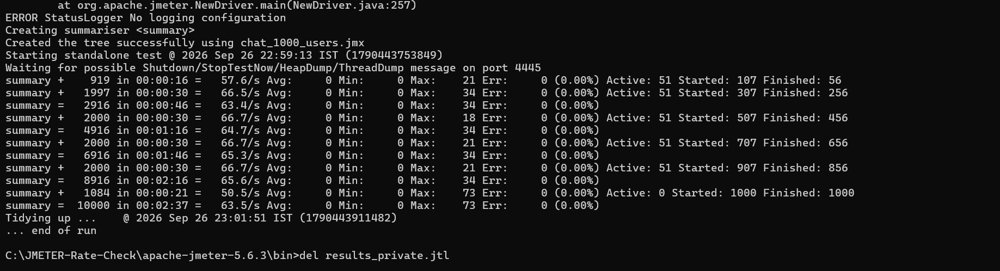
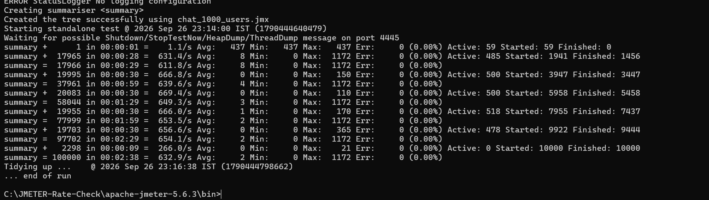
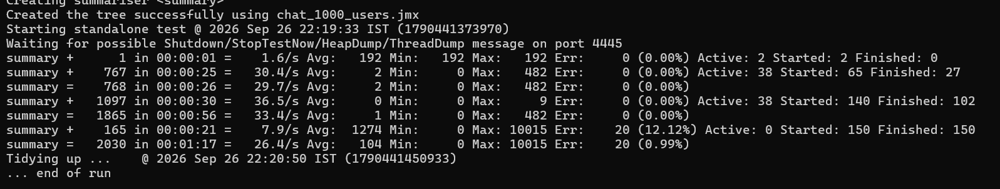
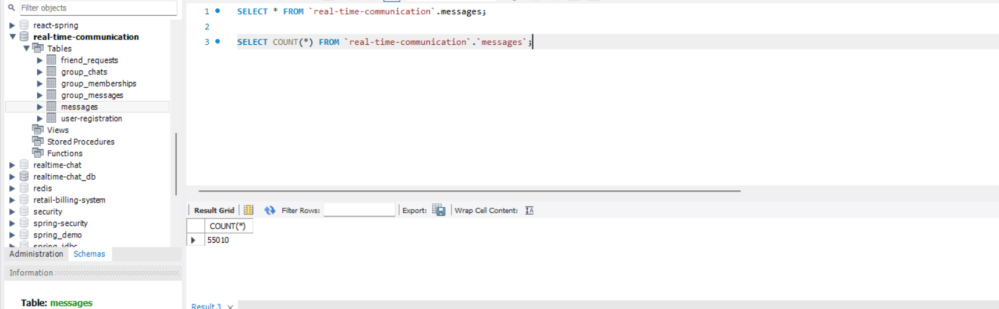
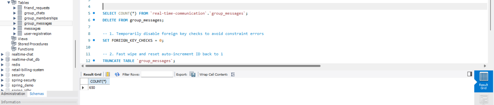

# 🚀 Real-Time Communication System

A production-inspired real-time messaging platform built using **Spring Boot**, **WebSocket/STOMP**, **JWT Authentication**, and **MySQL**.

The system supports secure one-to-one messaging, group chats, friend requests, offline message delivery, and real-time notifications using a hybrid **REST + WebSocket architecture**.

---

## 📌 Features

### Real-Time Communication

* One-to-one messaging using WebSocket/STOMP
* Group chat with topic-based broadcasting
* Instant message delivery for online users

### User Management

* User registration and authentication
* Friend request workflow
* Friend acceptance and relationship management

### Offline Messaging

* Messages persisted in MySQL
* Undelivered messages automatically synchronized when users reconnect

### Security

* JWT-based authentication
* BCrypt password hashing (strength 12)
* Custom WebSocket Handshake Interceptor
* Server-side sender and receiver validation

### Reliability

* Persistent message storage
* Chat history retrieval
* Duplicate subscription prevention
* Active connection tracking

---

## 🏗 Architecture

The system follows a hybrid architecture:

* **REST APIs** handle authentication, friend requests, chat history, and offline synchronization.
* **WebSocket/STOMP** handles real-time messaging and notifications.

```text
Client (React)
      │
      ├────────────── REST API ──────────────► Spring Boot
      │                                         │
      │                                         ▼
      │                                      MySQL
      │
      └────────── WebSocket/STOMP ──────────► Active User Sessions
```

---

## 🔄 Authentication Flow

```text
User Login
    │
    ▼
Spring Security
    │
    ▼
JWT Generated
    │
    ▼
JWT Returned To Client
    │
    ▼
Client Connects To WebSocket
    │
    ▼
Custom Handshake Interceptor
    │
    ├── Validate JWT
    ├── Extract User Identity
    └── Attach User To WebSocket Session
```

Only authenticated users are allowed to establish WebSocket connections.

---

## 💬 Private Messaging Flow

```text
Sender
   │
   ▼
WebSocket Message
   │
   ▼
Spring Controller
   │
   ├── Validate Sender
   ├── Validate Receiver
   ├── Validate Friendship
   └── Persist Message
   │
   ▼
SimpMessagingTemplate
   │
   ▼
Receiver Session
```

If the receiver is offline:

```text
Persist Message
      │
      ▼
Mark As Undelivered
      │
      ▼
Fetch On Reconnect
```

---

## 👥 Group Messaging Flow

```text
User A
User B
User C
   │
   ▼
/topic/group/{groupId}
   │
   ▼
Spring Boot Broadcast
   │
   ▼
All Group Members Receive Message
```

---

## 🗄 Database Design

| Table             | Purpose                 |
| ----------------- | ----------------------- |
| user_registration | User accounts           |
| messages          | Direct messages         |
| group_chats       | Group information       |
| group_memberships | User-group mapping      |
| group_messages    | Group conversations     |
| friend_requests   | Friend request workflow |

---

## ⚖ Engineering Decisions & Trade-offs

### Why WebSocket Instead Of Polling?

#### Polling

Pros:

* Simple implementation

Cons:

* High latency
* Unnecessary HTTP requests
* Increased server load

#### WebSocket

Pros:

* Persistent connection
* Real-time server push
* Lower latency

Cons:

* More complex connection lifecycle

Decision:
WebSocket was chosen because chat applications require low-latency communication and efficient server push.

---

### Why Hybrid REST + WebSocket?

Not every operation benefits from WebSocket.

REST is used for:

* Login
* Registration
* Friend Requests
* Chat History
* Offline Synchronization

WebSocket is used for:

* Live Messaging
* Notifications
* Group Broadcasting

This separation keeps the system maintainable and easier to scale.

---

### Why JWT Instead Of Server Sessions?

Pros:

* Stateless authentication
* Better scalability
* Reduced server memory usage

Cons:

* Token revocation complexity

Decision:
JWT aligns well with distributed architectures and modern REST APIs.

---

## 🚧 Challenges Faced

### 1. Message Duplication

Problem:
Users occasionally received duplicate messages.

Root Cause:
Multiple subscriptions created during reconnection.

Solution:

* Centralized WebSocket management
* Proper subscription cleanup
* Single active connection per user

---

### 2. Incorrect Message Routing

Problem:
Private messages appeared in group channels.

Root Cause:
Improper destination separation.

Solution:

```text
/user/queue/private
/topic/group/{groupId}
```

Strict routing boundaries eliminated message leakage.

---

### 3. Securing WebSocket Connections

Problem:
Spring Security does not automatically secure WebSocket traffic.

Solution:
Implemented a custom Handshake Interceptor that validates JWT tokens before connection establishment.

---

## 🔒 Security Considerations

Implemented protections against:

* Unauthorized WebSocket connections
* Password theft
* Message spoofing
* User impersonation
* Unauthorized direct messaging

Security measures:

* BCrypt password hashing
* JWT authentication
* Custom Handshake Interceptor
* Server-side sender validation
* Friendship verification before message delivery

---

## 📊 Load Testing

Load testing was performed using Apache JMeter.

### Configuration

* 100+ concurrent users
* WebSocket messaging scenarios
* Group chat scenarios
* Direct messaging scenarios

### Results

| Metric           | Result           |
| ---------------- | ---------------- |
| Throughput       | ~45 Requests/sec |
| Error Rate       | 0%               |
| Concurrent Users | 100+             |
| Message Loss     | None Observed    |

### Observation

The application remained stable under moderate concurrent load. The primary bottleneck was database persistence rather than WebSocket message delivery.

---

## 📈 Scalability Considerations

### Current Architecture

* Single Spring Boot instance
* In-memory WebSocket session tracking

### Limitations

* Not horizontally scalable
* Session metadata exists only on one node

### Future Enhancements

* Redis Pub/Sub
* RabbitMQ
* Kafka Event Streaming
* Distributed WebSocket Nodes
* Load Balancing

---

## 🛠 Tech Stack

| Layer               | Technology        |
| ------------------- | ----------------- |
| Frontend            | React             |
| Backend             | Spring Boot       |
| Security            | Spring Security   |
| Authentication      | JWT               |
| Password Hashing    | BCrypt            |
| Real-Time Messaging | WebSocket + STOMP |
| Database            | MySQL             |
| ORM                 | Spring Data JPA   |
| Build Tool          | Maven             |
| Testing             | JMeter            |

---

## 📂 Project Structure

```text
src/
├── Config/
├── Controller/
├── JWTConfig/
├── MessageModel_StructureModel/
├── Model/
├── Repo/
├── Service/
├── SocketConfig/
└── RealTimeCommunicationApplication.java
```

---

## 🚀 Getting Started

### Prerequisites

* Java 17+
* Maven
* MySQL 8+

### Clone Repository

```bash
git clone https://github.com/YourUsername/real-time-communication-system.git
```

### Configure Database

```properties
spring.datasource.url=jdbc:mysql://localhost:3306/chat_db
spring.datasource.username=root
spring.datasource.password=password
```

### Run Application

```bash
./mvnw spring-boot:run
```

---

## 🔮 Future Roadmap

* Read Receipts
* Typing Indicators
* User Presence Tracking
* Push Notifications
* Media/File Sharing
* End-to-End Encryption
* Redis-based Distributed Messaging
* Kafka Event Processing


## 🚀 Performance Benchmarking & Load Testing

To evaluate concurrency boundaries, system throughput, and database persistence reliability, the messaging backend was load-tested using **Apache JMeter in non-GUI CLI mode** on a single-machine deployment (Spring Boot, MySQL, and JMeter co-located)[cite: 3, 10, 11].

The benchmark evaluated the performance difference between **1-to-1 point-to-point delivery ($O(1)$ routing)** and **single-room broadcast delivery ($O(N^2)$ fan-out)**[cite: 2, 9, 10].

---

### 📊 Benchmark Comparison Summary

| Metric | Group Chat (Single Room) | Private Chat (1,000 Users) | Private Chat (5,000 Users Stress) |
| :--- | :--- | :--- | :--- |
| **Concurrent Virtual Threads** | 150 users[cite: 13] | 1,000 threads[cite: 11] | **10,000 threads (5,000 active pairs)**[cite: 3, 12] |
| **Total JMeter Samples** | 2,030 samples[cite: 13] | 10,000 samples[cite: 11] | **100,000 samples**[cite: 3, 12] |
| **Throughput (req/sec)** | 26.4 req/sec[cite: 13] | 63.5 req/sec[cite: 11] | **632.9 req/sec**[cite: 3, 12] |
| **Average Latency** | 104 ms[cite: 13] | 0 ms (sub-millisecond)[cite: 11] | **2 ms**[cite: 3, 12] |
| **Max Latency** | 10,015 ms (timeout cliff)[cite: 13] | 73 ms[cite: 11] | **1,172 ms**[cite: 3, 12] |
| **Error Rate** | 0.99% (20 socket timeouts)[cite: 13] | **0.00% (0 errors)**[cite: 11] | **0.00% (0 errors)**[cite: 3, 12] |
| **Messages Persisted to MySQL** | **650 rows** (in `group_messages`)[cite: 15] | 5,000 rows[cite: 3] | **50,000 rows** (cumulative **55,010** in `messages`)[cite: 14] |
| **Routing Pattern** | $O(N^2)$ broker fan-out[cite: 2, 10] | $O(1)$ direct user queue[cite: 2, 10] | $O(1)$ direct user queue[cite: 2, 10] |

---

### 🔍 Architectural Analysis & Findings

#### 1. Private Messaging Scalability ($O(1)$ Direct Routing)
* **High-Throughput Ingestion:** Under a peak concurrency of **10,000 threads** executing 5-message loops, the server sustained **632.9 requests/second** with an **average latency of only 2 ms**[cite: 3, 12].
* **Zero Dropped Frames:** The test completed **100,000 total actions with 0% error**[cite: 3, 12].
* **Transactional Reliability:** MySQL row counts confirmed that the 1,000-user baseline run (5,000 inserts) and the 5,000-user stress run (50,000 inserts) successfully committed **55,010 total rows** without duplicate primary keys or missed writes[cite: 3, 14].

#### 2. Group Chat Saturation Boundary ($O(N^2)$ Broadcast Fan-Out)
* **The Fan-Out Multiplier:** In a single room with 150 simultaneously chatting members, every incoming message must be duplicated across all 150 active subscribers ($150 \times 750 \approx \mathbf{112{,}500 \text{ outbound frames}}$)[cite: 2].
* **Buffer Congestion:** At 150 concurrent room members, the system delivered 650 messages cleanly before the local loopback TCP buffer and Spring's default outbound executor reached saturation, causing 20 threads to exceed the 10-second timeout ceiling[cite: 13, 15].
* **System Boundary Identified:** Demonstrates that a single standalone Spring Boot instance using in-memory `SimpleBroker` comfortably handles up to **~150 concurrent active broadcasters per room** before requiring an external distributed broker relay (e.g., RabbitMQ or Redis Pub/Sub)[cite: 2].

---

### 📷 Benchmark Verification & Execution Proof

#### 1. Private Messaging: 1,000 Users (10,000 Samples — 0.00% Error)
> Execution log showing sub-millisecond response times (`Avg: 0 ms`, `Max: 73 ms`, `Throughput: 63.5/s`)[cite: 11]:



#### 2. Private Messaging: 5,000 Users / 10,000 Threads (100,000 Samples — 0.00% Error)
> Peak stress execution log verifying sustained high throughput (`632.9/s`, `Avg: 2 ms`, `Err: 0 (0.00%)`)[cite: 12]:



#### 3. Group Messaging: 150 Users in 1 Room (Saturation Benchmark)
> Execution log capturing the single-room broadcast capacity boundary (`Err: 20 (0.99%)`, `Avg: 104 ms`)[cite: 13]:



#### 4. Database Persistence Verification (MySQL Workbench)
> Exact row counts confirming **55,010 private messages** (`5,000 + 50,000 + 10 test`) and **650 group messages** persisted to disk[cite: 14, 15]:

| Private Messages (`messages` table: 55,010 rows)[cite: 14] | Group Messages (`group_messages` table: 650 rows)[cite: 15] |
| :---: | :---: |
|  |  |

---

### 🛠️ Test Artifacts
All JMeter scripts and data-generation stored procedures used to reproduce these results are committed in the repository:
* JMeter Test Plan: [`chat_1000_users.jmx`](chat_1000_users.jmx)
* Database Seeding Procedure: `SeedJMeterUsers()` (seeds 5,000 unique user credentials)

```
```
